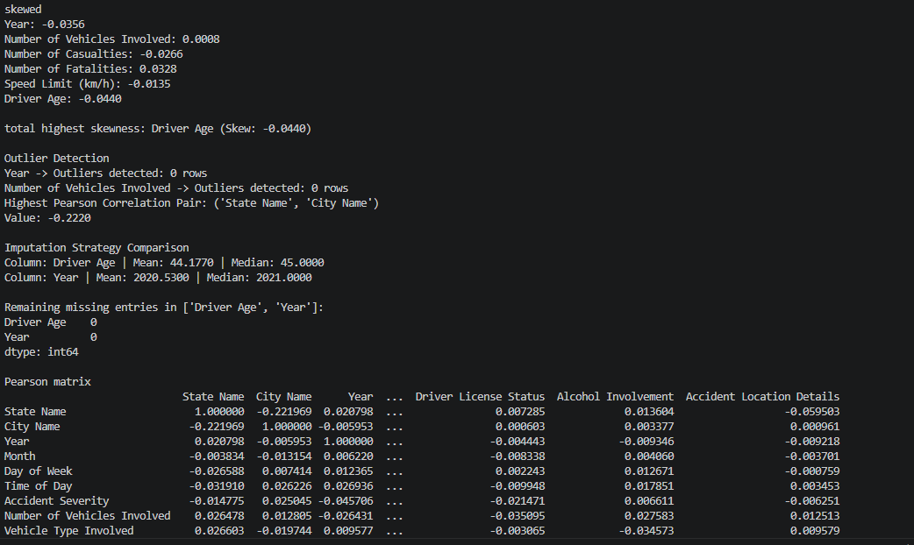

# Accident Prediction Capstone Project Part 1

The predictive analysis model is trained utilizing the India Road Accident Dataset sourced from Kaggle
# https://www.kaggle.com/datasets/khushikyad001/india-road-accident-dataset-predictive-analysis

Part 1: Feature Engineering (data cleaning)

"accident_prediction_india.csv" is actual dataSet 
            we have done:
            -> validated all null, remove dublicates, Outlier Detection with IQR
            -> generate categorical and heatmap
            -> remove unwanted lables 
            -> saved in the name of "cleaned_data.csv"
            -> saved plot png placed in "part1/plots" folder

# How to execute part1
     -> terminal reach to part1
     -> python "feature_engineering_data_cleaning.py" (execute this commant)
        on console you can see all scoring details and also plot will automatically create

# validated all null, remove dublicates, Outlier Detection with IQR, Pearson matrix, Strategy Comparison result screen shot

