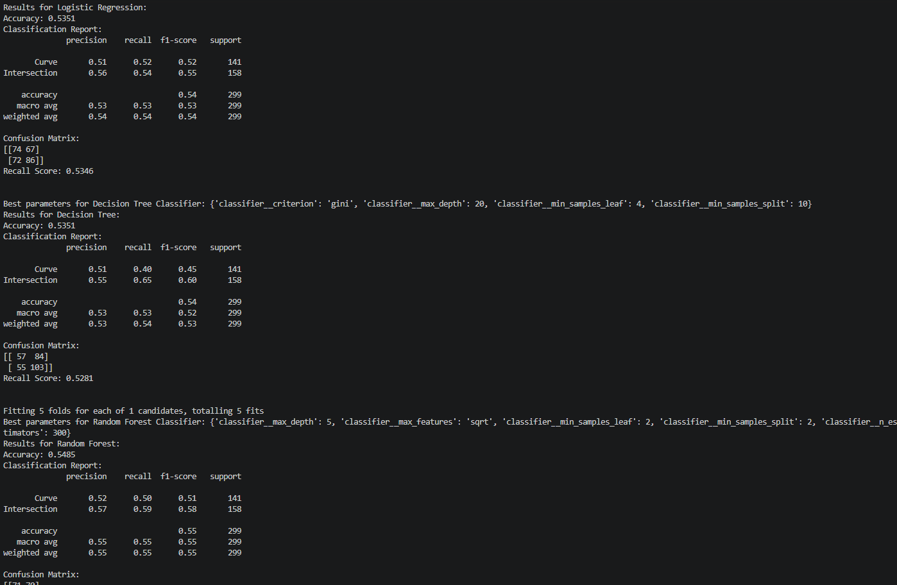

# Accident Prediction Capstone Project

part 2: Model selection Finding suitable ML model

    This project is Classification type prediction lable "Curve" or "Intersection" road

    Implemented SMOTE, pipeline , GridSearchCV, and plot

    presistion, recall and FI score tested with three model:
        -> logistic regression
        -> decision tree
        -> random forest 

    ROC and AUC plot generated for all three model best fit is "Random Forest" model

    Finalized Random Forest is best for predict forcasting Accident on "Curve" or "Intersection" road
    created "random_forest.py" file which we will use for our actual flow (take values from streamlit "app.py")

# How to execute part 2
    -> terminal reach to part2
    -> python "model_train_logisticRegression_decisionTree_randomForest.py" ( this command will train your model with clead data set )
    -> python "random_forest.py" ( this command is use to test perfect fit model 'random forest' alone)

# logisticRegression, decisionTree and randomForest score metrix result
