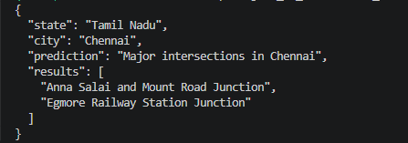

# Accident Prediction Capstone Project

part 3: LLM calling

    in this part we using "OpenRouter" to communicate with LLM and get list of "AREAS" based on "STATE", "CITY", "MONTH", "DAY OF WEEK" and "WEATHER CONDITION" and "ML" predicted value ( lable -> "CURVE" or "INTERSECTION" road )

    GuardRails are applied 
    Certain states "SOME CITY" are mention as city, in this case LLM will return us all "CURVE" or "INTERSECTION" in sate 
 

 # LLM responce in json format

 