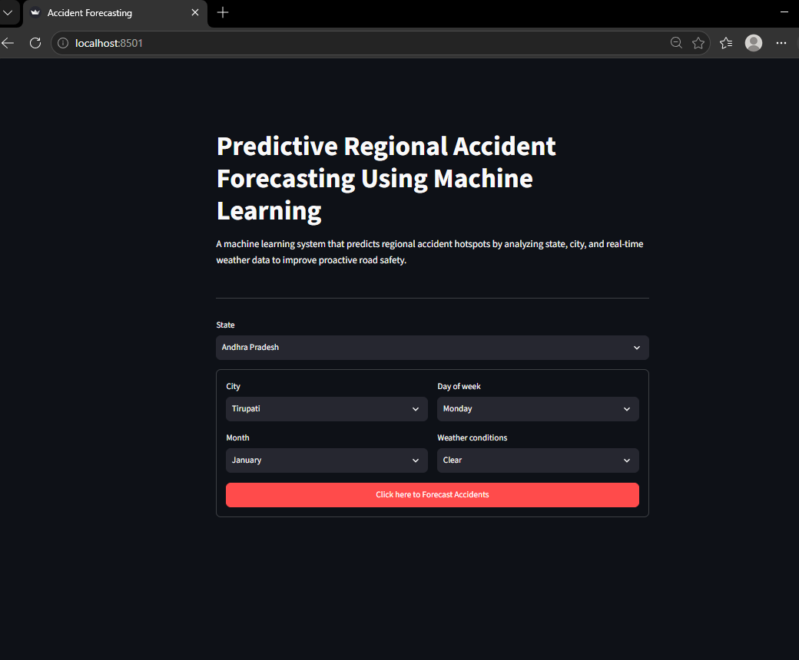
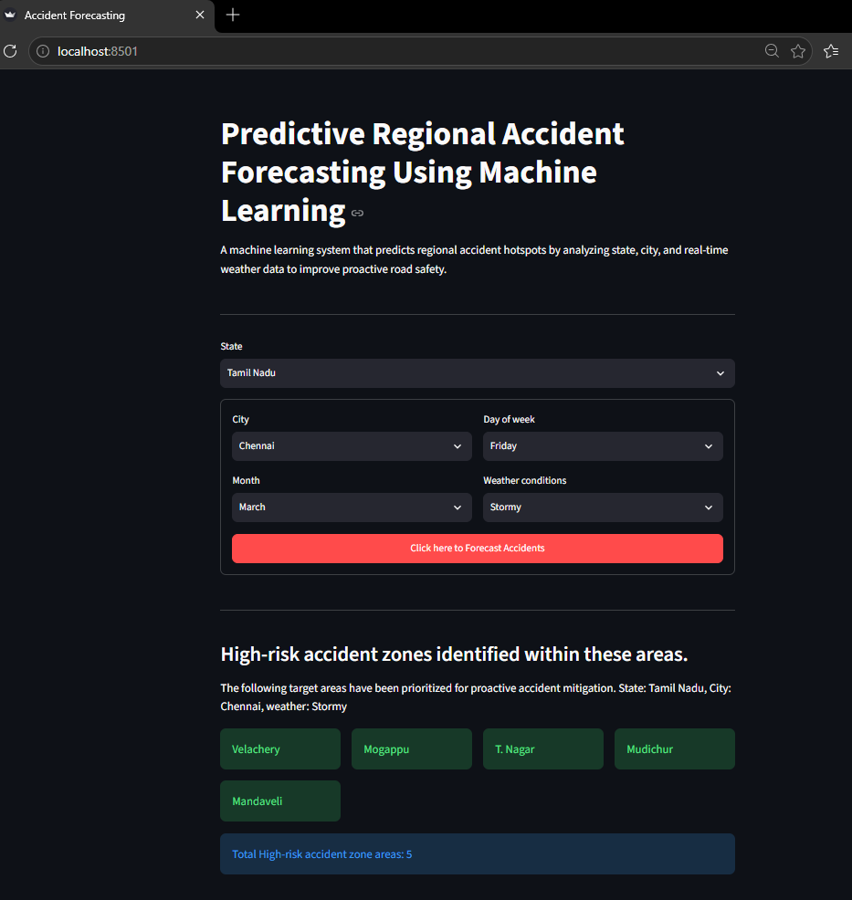

# Accident Prediction Capstone Project

part4 : streamlit app for front end 

        In This section we are creating "streamlit" application which use to interaction with user, all fields are mentioned in dropdown, so when user selected "Sate","City","month","day of week" and "weather conditon".

        Streamlit takes all the fields, pass to "random forest model" for prediction, Once get predicted value from model then it passed the predicted result to LLM for get all list of forecasting accident areas.

        Streamlit
            |
            -> part2
                |
                -> part3
                    |
                    ->Streamlit front end (show list of areas)

# Streamlit home screen

# Streamlit result screen ( Streamlit + ML + LLM )

